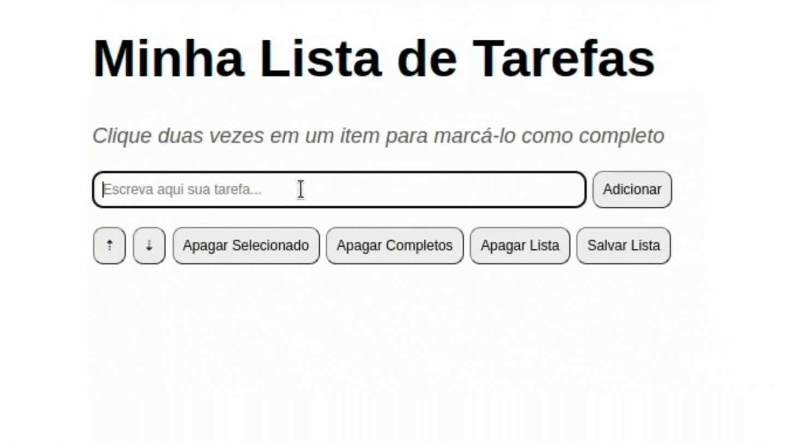

# Projeto Todo List

:rocket: *Desenvolvido em: 10/12/2021 - Bloco 05/Trybe*

## :dart: Objetivo

Desenvolver uma página web de uma lista de tarefas

## :brain: Habilidades desenvolvidas

- Manipular o DOM
- Utilizar eventos do Javascript
- Estilização por meio do CSS

## :hammer_and_wrench: Ferramentas utilizadas

- HTML
- Javascript
- CSS

:zap: *Todos os projetos da [Trybe](https://www.betrybe.com/?utm_medium=cpc&utm_source=google&utm_campaign=Brand&utm_content=ad03_din_h&gclid=Cj0KCQjw852XBhC6ARIsAJsFPN0TgLB25i-0iaTXpXGAYC5i-3mDoTto4laUGYI5XZFJpSlNbrojLuUaAs6cEALw_wcB) utilizam ESlint e Stylelint*

## :mailbox: Contatos

